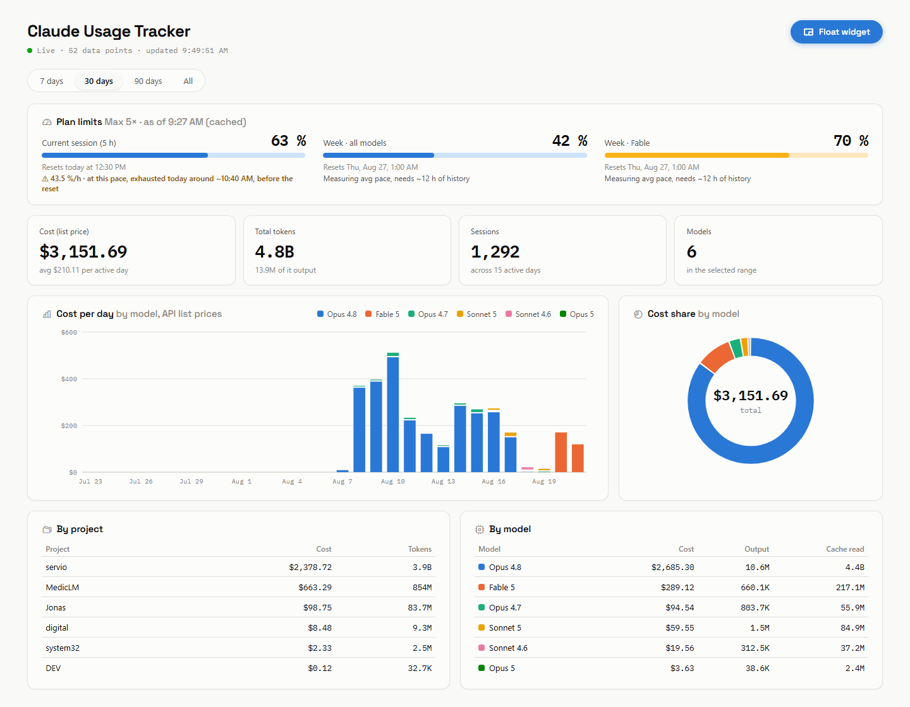

# Claude Usage Tracker

A local, zero-dependency dashboard for your [Claude Code](https://claude.com/claude-code) token usage, costs, and plan limits — with live updates, pace predictions, and a floating picture-in-picture widget.




## Features

- **Usage analytics** — daily cost per model as a stacked bar chart, plus breakdowns by project and model, computed from your local Claude Code transcripts
- **Live plan limits** — session (5 h) and weekly limits with progress meters, fetched live from Anthropic's OAuth usage endpoint using the token Claude Code already maintains
- **Pace predictions** — burn rate per limit and an estimate of when it runs out. The session limit uses a short window ("at this pace, exhausted at ~09:50"), weekly limits use a 72-hour average including idle time, since bursts are capped by the session limit anyway
- **Real-time updates** — a file watcher on `~/.claude/projects` pushes changes to the browser via Server-Sent Events; the chart ticks while your sessions run
- **Popout widget** — a compact always-on-top mini window via the Document Picture-in-Picture API (Chromium). Grows responsively: wider windows reveal reset times and stat tiles
- **CLI mode** — `npm run cli` renders the same limits, pace, and today's cost as a self-refreshing terminal widget
- **Light & dark** — follows your system theme, with an accessible, CVD-safe chart palette
- **Live pricing** — model prices are fetched from the community-maintained [LiteLLM price database](https://github.com/BerriAI/litellm) (daily refresh, disk-cached), with a built-in table as fallback
- **Zero runtime dependencies** — TypeScript, run natively by Node.js (type stripping). No frameworks, no build step for the server, nothing phoning home

## Quick start

```bash
git clone https://github.com/jonax1337/claude-usage-tracker.git
cd claude-usage-tracker
npm start
```

Open **http://localhost:3789**. That's it — `npm install` is only needed for development (TypeScript tooling); the server runs the `.ts` file natively and the compiled frontend is committed.

Requirements: Node.js ≥ 23.6 (native TypeScript support) and a machine where Claude Code has been used (transcripts in `~/.claude/projects`).

## How it works

| Data | Source |
|---|---|
| Tokens & costs | `~/.claude/projects/**/*.jsonl` — Claude Code's session transcripts. Each assistant message carries a `usage` block (input, output, cache read/write tokens). Costs are computed at public API list prices, so they are informative even on a subscription plan. |
| Plan limits | `https://api.anthropic.com/api/oauth/usage`, authenticated with the OAuth token Claude Code stores in `~/.claude/.credentials.json`. Falls back to Claude Code's own cache in `~/.claude.json` if the live fetch fails. |
| Pace history | Sampled every 5 minutes and persisted to `pace-history.json` (gitignored) so predictions survive restarts. |
| Model pricing | [LiteLLM price database](https://github.com/BerriAI/litellm/blob/main/model_prices_and_context_window.json), refreshed daily and cached to `pricing-cache.json` (gitignored). Falls back to a built-in table when offline. |

The server parses transcripts with per-file mtime caching and deduplicates streaming entries by message ID, so reloads stay fast even with large histories.

## CLI mode

A live terminal widget that keeps re-rendering in place — plan limits with colored meters, pace predictions, and today's cost:

```bash
npm run cli
```

```
Claude Usage Tracker  Max 5× · ● live 7:33:06 PM

  Session (5 h)      █████████████░░░░░░░░░░░  55%  resets ~10:49 PM
                     34.0 %/h · exhausted ~8:52 PM, before reset
  Week · all         ██████████████░░░░░░░░░░  59%  resets Thu ~12:59 AM
  Week · Fable       █████████████████████░░░  86%  resets Thu ~12:59 AM

  Today  $185.77 list price · 154.7M tokens

  refreshes every 30 s · Ctrl+C to quit
```

Web dashboard and CLI share the same data layer (`lib.ts`), including the pace history — run either or both.

## Popout widget

Click **Popout** in the header to get a floating mini window (Chromium's Document Picture-in-Picture — stays on top of everything). Firefox and others get a small regular window instead. You can also open `http://localhost:3789/?widget=1` directly.

## Configuration

| Env var | Default | Description |
|---|---|---|
| `PORT` | `3789` | HTTP port |

## Development

```bash
npm install          # TypeScript tooling (dev-only)
npm run build        # compile src/app.ts → public/app.js
npm run check        # typecheck server + frontend (strict mode)
```

`server.ts` runs natively via Node's type stripping — no bundler, no transpile step. The frontend source lives in `src/app.ts`; the compiled `public/app.js` is committed so a clone runs without building.

## Privacy

Everything runs locally. The only outbound request is the limits call to Anthropic's own API, using credentials already on your machine. No telemetry, no third-party services.

## Disclaimer

Cost figures are **computed API list prices**, not what you are billed — on Pro/Max subscriptions they serve as a consumption indicator. Predictions are linear extrapolations and intentionally approximate. This is an unofficial community tool, not affiliated with Anthropic.

## License

[MIT](LICENSE)
